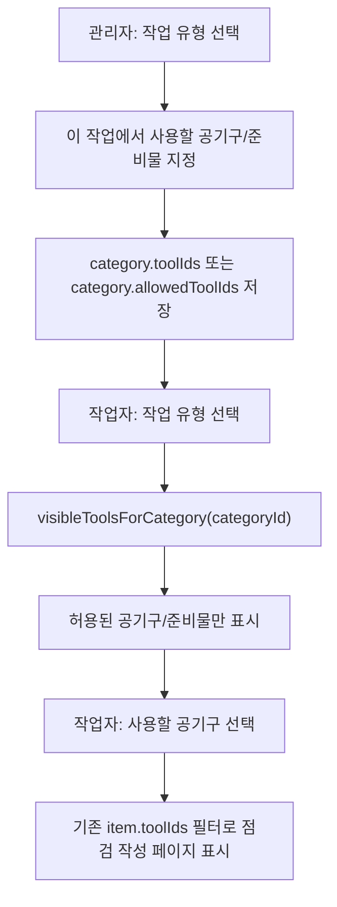

# Category Tool Availability Implementation Plan

> **For agentic workers:** REQUIRED SUB-SKILL: Use superpowers:subagent-driven-development (recommended) or superpowers:executing-plans to implement this plan task-by-task. Steps use checkbox (`- [ ]`) syntax for tracking.

**Goal:** Let admins define which 공기구/준비물 are usable for each 점검 항목/작업 유형, then show only those related tools to workers in the 공기구/준비물 selection screen.

**Architecture:** Keep the existing worker flow: 작업 전 점검 -> 작업 유형 선택 -> 공기구/준비물 선택 -> 점검 작성. Add a category-level allowed tool mapping and filter `renderToolPrep(cat)` by that mapping. Preserve existing item-level `toolIds` behavior for the final checklist page.

**Tech Stack:** Static HTML/CSS/JavaScript, localStorage/Supabase sync via existing app state, Node built-in test scripts, existing `npm.cmd run verify` workflow.

---

## Actual Screen Model

### 1. 관리자: 작업 유형별 사용 공기구 지정

```text
관리자 > 작업 유형 관리

┌──────────────────────────────┐
│ 선행 설치 작업                │
│ 공기구 확인 필요              │
├──────────────────────────────┤
│ 이 작업에서 사용할 공기구/준비물 │
│                              │
│ ☑ 와이어                      │
│ ☑ 샤클                        │
│ ☑ 슬링벨트                    │
│ ☑ 작업용 발판                 │
│ ☐ 도장 스프레이건              │
│ ☐ 전기 테스터기                │
│ ☐ 용접 토치                   │
│                              │
│ [저장]                        │
└──────────────────────────────┘
```

### 2. 작업자: 점검 항목/작업 유형 선택

```text
작업 전 점검

┌──────────────────────────────┐
│ 선행 설치 작업                │
└──────────────────────────────┘

┌──────────────────────────────┐
│ 도장 작업                     │
└──────────────────────────────┘
```

### 3. 작업자: 공기구/준비물 선택

When worker selects `선행 설치 작업`, only tools allowed by admin for that work type appear.

```text
사용 공기구와 준비물
선행 설치 작업

┌──────────────┐ ┌──────────────┐
│ ☐ 와이어     │ │ ☐ 샤클       │
└──────────────┘ └──────────────┘

┌──────────────┐ ┌──────────────┐
│ ☐ 슬링벨트   │ │ ☐ 작업용 발판 │
└──────────────┘ └──────────────┘

[다음 점검표로]
```

These unrelated tools must not appear for `선행 설치 작업`:

```text
도장 스프레이건
전기 테스터기
용접 토치
```

### 4. 작업자: 점검 작성 페이지

This remains existing behavior: selected tools determine which item-level safety checklist rows appear.

```text
선행 설치 작업 점검표

┌──────────────────────────────┐
│ ☐ 와이어 손상 여부 확인       │
│                         위험 │
└──────────────────────────────┘

┌──────────────────────────────┐
│ ☐ 샤클 체결 상태 확인         │
│                         위험 │
└──────────────────────────────┘

┌──────────────────────────────┐
│ ☐ 작업 위치 정리정돈          │
│                         주의 │
└──────────────────────────────┘
```

---

## Data Flow



---

## File Structure

- Modify: `assets/js/app-v2.js`
  - Add category-level allowed tool IDs, using a stable property name: `toolIds`.
  - Persist category `toolIds` through localStorage and Supabase category sync.
  - Add admin UI to choose usable tools for each category.
  - Update `visibleToolsForCategory(categoryId)` so worker tool-prep screen shows only category-allowed tools.
  - Keep item-level `toolIds` untouched for final checklist filtering.
- Modify: `assets/css/styles-v2.css`
  - Add or reuse compact checkbox/grid styles for category-level tool picker in admin.
  - Keep mobile tool-prep grid stable.
- Modify: `tests/static-recovery.test.js`
  - Lock static hooks for category tool picker and visible tool filtering.

---

### Task 1: Add Regression Assertions

**Files:**
- Modify: `tests/static-recovery.test.js`

- [ ] **Step 1: Add static assertions for category tool availability**

Add these assertions:

```js
assert.match(app, /function renderCategoryToolPicker\(\{ groupId, selectedIds \}\)/);
assert.match(app, /function selectedCategoryToolIds\(groupId\)/);
assert.match(app, /function categoryAllowedToolIds\(categoryId\)/);
assert.match(app, /function visibleToolsForCategory\(categoryId\)/);
assert.match(app, /toolIds: sanitizeToolIds\(row\.toolIds\)/);
```

- [ ] **Step 2: Run verify and expect failure before implementation**

Run:

```powershell
npm.cmd run verify
```

Expected: fails until category tool availability implementation exists.

---

### Task 2: Persist Category-Level Tool IDs

**Files:**
- Modify: `assets/js/app-v2.js`

- [ ] **Step 1: Update category DB sync mapping**

In the category sync config, include `toolIds` in both directions:

```js
tool_ids: sanitizeToolIds(row.toolIds),
```

and:

```js
toolIds: sanitizeToolIds(row.tool_ids),
```

- [ ] **Step 2: Normalize categories after load**

In the category normalization block, ensure:

```js
toolIds: sanitizeToolIds(row.toolIds),
```

- [ ] **Step 3: Run verify**

Run:

```powershell
npm.cmd run verify
```

Expected: syntax passes, static test still fails until UI/filter helpers are added.

---

### Task 3: Add Admin Category Tool Picker

**Files:**
- Modify: `assets/js/app-v2.js`

- [ ] **Step 1: Add category tool picker renderer**

Add near `renderItemToolPicker`:

```js
function renderCategoryToolPicker({ groupId, selectedIds }) {
  const selected = new Set(sanitizeToolIds(selectedIds));
  const tools = activeTools();
  return `<div class="field category-tool-picker">
    <div class="field-label">이 작업에서 사용할 공기구/준비물</div>
    ${tools.length ? `<div class="category-tool-options">
      ${tools.map((tool) => {
        const inputId = `categoryTool_${groupId}_${tool.id}`;
        return `<label class="item-tool-option" for="${esc(inputId)}">
          <input id="${esc(inputId)}" type="checkbox" value="${esc(tool.id)}" data-category-tool-group="${esc(groupId)}" ${selected.has(tool.id) ? "checked" : ""} ${state.adminMode ? "" : "disabled"} />
          <span>${esc(tool.name)}</span>
          ${natureBadge(tool.nature)}
        </label>`;
      }).join("")}
    </div>` : `<div class="empty empty-section-note">등록된 공기구/준비물이 없습니다.</div>`}
  </div>`;
}
```

- [ ] **Step 2: Add selected category tool IDs helper**

Add near `selectedItemToolIds(groupId)`:

```js
function selectedCategoryToolIds(groupId) {
  return Array.from(document.querySelectorAll("[data-category-tool-group]"))
    .filter((node) => node.dataset.categoryToolGroup === groupId && node.checked)
    .map((node) => node.value);
}
```

- [ ] **Step 3: Render picker in category edit UI**

In the category edit/admin row, include:

```js
${renderCategoryToolPicker({ groupId: `category_${row.id}`, selectedIds: row.toolIds })}
```

- [ ] **Step 4: Save category tool IDs with category edits**

Where category save logic updates the category row, include:

```js
toolIds: selectedCategoryToolIds(`category_${id}`),
```

- [ ] **Step 5: Run verify**

Run:

```powershell
npm.cmd run verify
```

Expected: static test still fails until filtering helper is added.

---

### Task 4: Filter Worker Tool Prep by Category Availability

**Files:**
- Modify: `assets/js/app-v2.js`

- [ ] **Step 1: Add category allowed tool helper**

Add near `toolsFor`:

```js
function categoryAllowedToolIds(categoryId) {
  const cat = categoryById(categoryId);
  return sanitizeToolIds(cat?.toolIds);
}
```

- [ ] **Step 2: Update visibleToolsForCategory**

Make `visibleToolsForCategory(categoryId)` first narrow to active tools for the category, then apply category allowed IDs when present:

```js
function visibleToolsForCategory(categoryId) {
  const allowed = new Set(categoryAllowedToolIds(categoryId));
  const tools = toolsFor(categoryId).filter((tool) => toolMatchesCategoryNature(tool, categoryById(categoryId)?.toolNature));
  if (!allowed.size) return tools;
  return tools.filter((tool) => allowed.has(tool.id));
}
```

If the existing function has additional rules, preserve them and insert the allowed-ID filter at the end.

- [ ] **Step 3: Run verify**

Run:

```powershell
npm.cmd run verify
```

Expected: all static and unit tests pass.

---

### Task 5: Style Admin Category Tool Picker

**Files:**
- Modify: `assets/css/styles-v2.css`

- [ ] **Step 1: Reuse item tool option grid**

Add:

```css
.category-tool-picker {
  grid-column: 1 / -1;
  min-width: 0;
}

.category-tool-options {
  display: grid;
  grid-template-columns: repeat(auto-fit, minmax(170px, 1fr));
  gap: 6px;
}
```

- [ ] **Step 2: Run verify**

Run:

```powershell
npm.cmd run verify
```

Expected: all tests pass.

---

### Task 6: Manual Screen Verification

**Files:**
- No source files unless verification finds a defect.

- [ ] **Step 1: Admin setup**

Check:
- Enter admin mode.
- Open a work type, e.g. `선행 설치 작업`.
- Select only relevant tools in `이 작업에서 사용할 공기구/준비물`.
- Save.

- [ ] **Step 2: Worker flow**

Check:
- Enter `작업 전 점검`.
- Select `선행 설치 작업`.
- Confirm only tools selected by admin appear.
- Confirm unrelated tools do not appear.
- Select one or more visible tools.
- Continue.
- Confirm final checklist behavior remains the same as before.

- [ ] **Step 3: Admin edit/delete compatibility**

Check:
- Add or edit a safety checklist item and connect it to a visible tool.
- Confirm the final checklist uses the item-level tool connection as before.
- Delete a safety checklist item.
- Confirm deleted item is removed from active checklist.

---

### Task 7: Final Verification Before Release

**Files:**
- No source files unless verification reveals a defect.

- [ ] **Step 1: Run full local verify**

Run:

```powershell
npm.cmd run verify
```

Expected:

```text
checklist-rules tests passed
issue-material-rules tests passed
static recovery tests passed
```

- [ ] **Step 2: Review git status**

Run:

```powershell
git status --short
```

- [ ] **Step 3: Wait for deployment request**

Do not bump `VERSION.md`, create a version tag, or deploy until the user says `배포 하자` or an equivalent deployment request.

---

## Self-Review

Spec coverage:
- Admin can define usable tools per work type: Tasks 2-3.
- Worker sees only work-type-related tools in the tool-prep screen: Task 4 and Task 6.
- Existing final checklist behavior remains item-level tool based: Task 6.
- Admin item add/edit/delete compatibility is verified: Task 6.
- Does not deploy until explicitly requested: Task 7.

Placeholder scan:
- No TBD/TODO/fill-in-later placeholders.
- Each implementation step includes exact file paths, code, commands, and expected results.

Type consistency:
- Category-level allowed tools use `category.toolIds`.
- Existing item-level checklist filtering keeps using `item.toolIds`.
