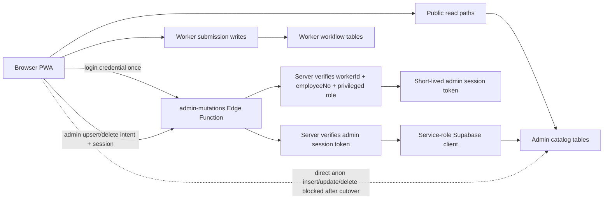

# Admin Mutation Boundary Implementation Plan

> **For agentic workers:** REQUIRED SUB-SKILL: Use superpowers:subagent-driven-development (recommended) or superpowers:executing-plans to implement this plan task-by-task. Steps use checkbox (`- [ ]`) syntax for tracking.

**Goal:** Move Phase 2A admin-managed writes behind a server-validated Supabase Edge Function before tightening RLS/grants.

**Architecture:** The browser keeps public reads and worker submission inserts, but admin catalog writes and admin record updates/deletes go through a new `admin-mutations` Edge Function. The function first issues a short-lived server-side admin session after a privileged worker login check, then verifies that session for whitelisted upserts/deletes with the service role. Only after that cutover can direct anon writes be revoked on protected admin paths.

**Tech Stack:** Static PWA, vanilla JavaScript in `assets/js/app-v2.js`, Supabase Edge Functions on Deno, Supabase Postgres RLS/grants, Node static tests, existing `npm.cmd run verify`.

---

## Current State

- Production is at `0.8-20260527`.
- `worker-push` is the only deployed Edge Function and has `verify_jwt = true`.
- `workers.employee_no` is no longer exposed through ordinary browser worker sync.
- The browser still contains client-side admin/reset gates. Do not copy the values into docs, prompts, commits, or logs.
- `assets/js/app-v2.js` still performs direct anon REST upserts/deletes for admin-managed data through `persistAndSync()`, `upsertTable()`, `deleteRemoteRows()`, and table-specific delete helpers.
- Live RLS/policy inventory shows broad `anon all ... using true with check true` policies on the admin catalog tables.
- Live grant inventory shows broad anon/authenticated write grants on many public tables. Phase 2A must reduce only the tables it replaces with server mutations.

## Phase 2A Scope

Protect these admin-managed tables first:

- `workers`
- `safety_categories`
- `safety_sections`
- `safety_items`
- `safety_tools`
- `safety_pictograms`
- `safety_ships`

Do not change these workflows in Phase 2A:

- Inspection submission: `safety_inspections`, `safety_inspection_items`
- Work prep records: `work_prep_records`
- Push registration/device management: `worker_push_subscriptions` and `worker-push`

Additional Phase 2A hardening added after review:

- `unsafe_issues`, `missing_materials`, and `issue_photos` stay public `SELECT/INSERT` for field submission.
- Admin status/memo updates and deletes for those records route through `admin-mutations`.
- Photo metadata/storage cleanup routes through `admin-mutations`.

Reason: reviewer feedback showed that leaving direct public `UPDATE/DELETE` on record tables would keep an admin bypass alive even after catalog writes moved server-side.

## Security Model



Phase 2A server authorization starts from the existing worker login secret pattern:

- Frontend sends `workerId` and the employee number already typed during worker login only to create the admin session.
- Edge Function reads `workers.employee_no` using service role.
- Edge Function allows admin mutation only when the worker is active and has one of the existing privileged positions used by the app (`representative`, `admin`, `general affairs` in the local Korean labels).
- Subsequent admin mutations send only the short-lived admin session token, not the employee number.
- Client-side admin password is removed as server authorization and old password-sourced admin sessions are cleared.

Optional later extension:

- Add a server-side admin password/hash stored in Supabase Function secrets or Vault.
- Do not put that password/hash in the frontend bundle or docs.

## Files

- Create: `supabase/functions/admin-mutations/index.ts`
- Create: `supabase/functions/admin-mutations/deno.json`
- Create: `supabase/migrations/20260527090000_admin_mutation_boundary.sql`
- Create: `tests/admin-mutation-boundary-static.test.js`
- Modify: `assets/js/app-v2.js`
- Modify: `package.json`
- Optional deploy note after live rollout: `docs/deployments/2026-05-27-admin-mutation-boundary.md`

## Task 1: Add Static Failing Tests

**Files:**
- Create: `tests/admin-mutation-boundary-static.test.js`
- Modify: `package.json`

- [ ] **Step 1: Create the failing static test**

Create `tests/admin-mutation-boundary-static.test.js` with this content:

```js
const fs = require("fs");
const path = require("path");

const root = path.resolve(__dirname, "..");
const read = (file) => fs.readFileSync(path.join(root, file), "utf8");

function expectMatch(source, pattern, message) {
  if (!pattern.test(source)) throw new Error(message);
}

function expectNoMatch(source, pattern, message) {
  if (pattern.test(source)) throw new Error(message);
}

const app = read("assets/js/app-v2.js");
const edge = read("supabase/functions/admin-mutations/index.ts");
const migration = read("supabase/migrations/20260527090000_admin_mutation_boundary.sql");
const pkg = JSON.parse(read("package.json"));

expectMatch(edge, /const ADMIN_TABLES = new Map/i, "admin-mutations must whitelist table keys");
expectMatch(edge, /function verifiedAdminWorker/i, "admin-mutations must verify privileged worker server-side");
expectMatch(edge, /SUPABASE_SERVICE_ROLE_KEY/, "admin-mutations must use service role only inside the Edge Function");
expectMatch(edge, /action === "upsertRows"/, "admin-mutations must support whitelisted upserts");
expectMatch(edge, /action === "deleteRows"/, "admin-mutations must support whitelisted deletes");
expectNoMatch(edge, /from\\(table\\)/, "admin-mutations must not use arbitrary table names");

expectMatch(app, /const ADMIN_REMOTE_KEYS = new Set\\(/, "frontend must classify admin-managed remote keys");
expectMatch(app, /functions\\.invoke\\("admin-mutations"/, "frontend admin writes must invoke the Edge Function");
expectMatch(app, /function adminMutationAuthPayload\\(/, "frontend must send worker-session auth for admin mutations");
expectNoMatch(app, /const ADMIN_PASSWORD\\s*=/, "admin password must not remain as a hardcoded frontend constant after Phase 2A");
expectNoMatch(app, /const RECORD_RESET_PASSWORD\\s*=/, "record reset password must not remain as a hardcoded frontend constant after Phase 2A");

[
  "workers",
  "safety_categories",
  "safety_sections",
  "safety_items",
  "safety_tools",
  "safety_pictograms",
  "safety_ships",
].forEach((table) => {
  expectMatch(
    migration,
    new RegExp(`revoke\\\\s+insert,\\\\s*update,\\\\s*delete\\\\s+on\\\\s+table\\\\s+public\\\\.${table}\\\\s+from\\\\s+public,\\\\s*anon,\\\\s*authenticated`, "i"),
    `${table} direct browser write grants should be revoked`,
  );
});

expectMatch(migration, /drop policy if exists "anon all safety categories"/i, "broad category policy should be dropped");
expectMatch(migration, /drop policy if exists "workers public insert"/i, "workers public insert policy should be dropped");
expectMatch(migration, /drop policy if exists "workers public update"/i, "workers public update policy should be dropped");
expectMatch(pkg.scripts.verify, /tests\\/admin-mutation-boundary-static\\.test\\.js/, "verify script should include admin mutation boundary static test");

console.log("admin mutation boundary static tests passed");
```

- [ ] **Step 2: Add the test to `package.json`**

Append it to the existing `verify` command:

```json
"verify": "node --check assets/js/app-v2.js && node --check assets/js/checklist-rules.js && node --check assets/js/issue-material-rules.js && node --check tools/quality-harness.mjs && node --check tools/claude-quality-harness.mjs && node tests/checklist-rules.test.js && node tests/issue-material-rules.test.js && node tests/static-recovery.test.js && node tests/harness-config.test.js && node tests/worker-security-static.test.js && node tests/admin-mutation-boundary-static.test.js"
```

- [ ] **Step 3: Run the static test and confirm it fails**

Run:

```powershell
node tests/admin-mutation-boundary-static.test.js
```

Expected: FAIL because `admin-mutations` files and frontend boundary do not exist yet.

- [ ] **Step 4: Commit**

```powershell
git add package.json tests/admin-mutation-boundary-static.test.js
git commit -m "test: guard admin mutation boundary"
```

## Task 2: Add `admin-mutations` Edge Function

**Files:**
- Create: `supabase/functions/admin-mutations/index.ts`
- Create: `supabase/functions/admin-mutations/deno.json`

- [ ] **Step 1: Add `deno.json`**

Create `supabase/functions/admin-mutations/deno.json`:

```json
{
  "imports": {
    "@supabase/supabase-js": "npm:@supabase/supabase-js@2.105.3"
  }
}
```

- [ ] **Step 2: Add the Edge Function**

Create `supabase/functions/admin-mutations/index.ts`:

```ts
import "jsr:@supabase/functions-js/edge-runtime.d.ts";
import { createClient } from "@supabase/supabase-js";

const corsHeaders = {
  "Access-Control-Allow-Origin": "*",
  "Access-Control-Allow-Headers": "authorization, x-client-info, apikey, content-type",
  "Access-Control-Allow-Methods": "POST, OPTIONS",
};

const PRIVILEGED_POSITIONS = new Set(["대표", "관리", "총무"]);
const PRIVILEGED_TEAMS = new Set(["관리", "총무"]);

type TableConfig = {
  table: string;
  columns: Set<string>;
};

const ADMIN_TABLES = new Map<string, TableConfig>([
  ["workers", {
    table: "workers",
    columns: new Set(["id", "name", "team", "position", "active", "unsafe_push_target", "created_at", "updated_at"]),
  }],
  ["categories", {
    table: "safety_categories",
    columns: new Set(["id", "label", "icon", "color", "require_tool_check", "tool_nature", "tool_ids", "sort_order"]),
  }],
  ["sections", {
    table: "safety_sections",
    columns: new Set(["id", "category_id", "title", "sort_order"]),
  }],
  ["items", {
    table: "safety_items",
    columns: new Set(["id", "category_id", "section_id", "text", "risk", "required", "active", "tool_ids", "visibility_condition", "sort_order"]),
  }],
  ["tools", {
    table: "safety_tools",
    columns: new Set(["id", "category_id", "name", "nature", "deleted", "sort_order"]),
  }],
  ["pictograms", {
    table: "safety_pictograms",
    columns: new Set(["id", "label", "src", "source", "deleted", "sort_order"]),
  }],
  ["ships", {
    table: "safety_ships",
    columns: new Set(["id", "no", "type", "note", "process_stage", "delivery_type", "delivery_date", "created_at", "sort_order"]),
  }],
]);

const supabase = createClient(
  Deno.env.get("SUPABASE_URL") || "",
  Deno.env.get("SUPABASE_SERVICE_ROLE_KEY") || "",
  {
    auth: {
      autoRefreshToken: false,
      persistSession: false,
    },
  },
);

function jsonResponse(body: unknown, status = 200) {
  return new Response(JSON.stringify(body), {
    status,
    headers: { ...corsHeaders, "Content-Type": "application/json" },
  });
}

function cleanText(value: unknown, max = 200) {
  return String(value || "").trim().slice(0, max);
}

function normalizeEmployeeNo(value: unknown) {
  return String(value || "").trim();
}

function rowObject(value: unknown) {
  return value && typeof value === "object" && !Array.isArray(value)
    ? value as Record<string, unknown>
    : null;
}

function cleanRow(config: TableConfig, value: unknown) {
  const row = rowObject(value);
  if (!row) return null;
  const id = cleanText(row.id, 120);
  if (!id) return null;
  const next: Record<string, unknown> = {};
  for (const column of config.columns) {
    if (Object.prototype.hasOwnProperty.call(row, column)) next[column] = row[column];
  }
  next.id = id;
  return next;
}

function cleanIds(value: unknown) {
  return Array.isArray(value)
    ? [...new Set(value.map((id) => cleanText(id, 120)).filter(Boolean))]
    : [];
}

async function verifiedAdminWorker(payload: Record<string, unknown>) {
  const auth = rowObject(payload.adminAuth) || {};
  const workerId = cleanText(auth.workerId, 120);
  const employeeNo = normalizeEmployeeNo(auth.employeeNo);
  if (!workerId || !employeeNo) return { error: jsonResponse({ error: "admin_worker_required" }, 403) };

  const { data: worker, error } = await supabase
    .from("workers")
    .select("id,name,team,position,active,employee_no")
    .eq("id", workerId)
    .eq("active", true)
    .maybeSingle();

  if (error) return { error: jsonResponse({ error: error.message }, 500) };
  if (!worker || normalizeEmployeeNo(worker.employee_no) !== employeeNo) {
    return { error: jsonResponse({ error: "admin_verification_failed" }, 403) };
  }

  const position = cleanText(worker.position, 80);
  const team = cleanText(worker.team, 80);
  if (!PRIVILEGED_POSITIONS.has(position) && !PRIVILEGED_TEAMS.has(team)) {
    return { error: jsonResponse({ error: "admin_forbidden" }, 403) };
  }

  return { worker };
}

async function upsertRows(payload: Record<string, unknown>) {
  const config = ADMIN_TABLES.get(cleanText(payload.key, 80));
  if (!config) return jsonResponse({ error: "unknown_key" }, 400);
  const rows = Array.isArray(payload.rows)
    ? payload.rows.map((row) => cleanRow(config, row)).filter(Boolean) as Record<string, unknown>[]
    : [];
  if (!rows.length) return jsonResponse({ ok: true, mutated: 0 });

  const authorization = await verifiedAdminWorker(payload);
  if (authorization.error) return authorization.error;

  const { error } = await supabase.from(config.table).upsert(rows, { onConflict: "id" });
  if (error) return jsonResponse({ error: error.message }, 500);
  return jsonResponse({ ok: true, mutated: rows.length });
}

async function deleteRows(payload: Record<string, unknown>) {
  const config = ADMIN_TABLES.get(cleanText(payload.key, 80));
  if (!config) return jsonResponse({ error: "unknown_key" }, 400);
  const ids = cleanIds(payload.ids);
  if (!ids.length) return jsonResponse({ ok: true, mutated: 0 });

  const authorization = await verifiedAdminWorker(payload);
  if (authorization.error) return authorization.error;

  const { error } = await supabase.from(config.table).delete().in("id", ids);
  if (error) return jsonResponse({ error: error.message }, 500);
  return jsonResponse({ ok: true, mutated: ids.length });
}

Deno.serve(async (req) => {
  if (req.method === "OPTIONS") return new Response("ok", { headers: corsHeaders });
  if (req.method !== "POST") return jsonResponse({ error: "method_not_allowed" }, 405);

  let payload: Record<string, unknown>;
  try {
    payload = await req.json();
  } catch {
    return jsonResponse({ error: "invalid_json" }, 400);
  }

  const action = cleanText(payload.action, 80);
  if (action === "upsertRows") return upsertRows(payload);
  if (action === "deleteRows") return deleteRows(payload);
  if (action === "ping") return jsonResponse({ ok: true });
  return jsonResponse({ error: "unknown_action" }, 400);
});
```

- [ ] **Step 3: Validate TypeScript syntax**

Run:

```powershell
npx.cmd --yes deno check supabase/functions/admin-mutations/index.ts
```

Expected: PASS. If `deno` cannot be run through `npx`, use Supabase MCP deployment validation in Task 6 instead.

- [ ] **Step 4: Commit**

```powershell
git add supabase/functions/admin-mutations
git commit -m "feat: add admin mutation edge function"
```

## Task 3: Route Frontend Admin Writes Through Edge Function

**Files:**
- Modify: `assets/js/app-v2.js`

- [ ] **Step 1: Add admin key classification near `REMOTE_TABLES`**

Add this after `REMOTE_TABLES`:

```js
const ADMIN_REMOTE_KEYS = new Set([
  "workers",
  "categories",
  "sections",
  "items",
  "tools",
  "pictograms",
  "ships",
]);
```

- [ ] **Step 2: Replace hardcoded admin/reset password constants**

Remove the top-level frontend constants for admin and reset passwords. Keep UI entry points, but do not compare against frontend constants.

Add these helpers near `requireAdminWrite()`:

```js
function adminMutationAuthPayload() {
  return {
    workerId: state.workerSession?.workerId || "",
    employeeNo: normalizeEmployeeNo(state.workerSession?.employeeNo || ""),
  };
}

function canAttemptServerAdminWrite() {
  const auth = adminMutationAuthPayload();
  return Boolean(auth.workerId && auth.employeeNo);
}

function requireAdminWrite() {
  if (!requireAdmin()) return false;
  if (canAttemptServerAdminWrite()) return true;
  toast("서버 저장은 관리자 권한 작업자 로그인 후 사용할 수 있습니다.");
  return false;
}
```

Change `requestAdminAccess()` so password-only mode no longer authorizes server writes. The safest Phase 2A behavior is:

```js
function requestAdminAccess() {
  toast("관리자 수정은 관리자 권한 작업자 로그인 후 사용할 수 있습니다.");
  return false;
}
```

If the product owner requires password-only admin mode to remain, stop here and implement the optional server-side password/hash path first. Do not keep a browser-visible password as server authorization.

- [ ] **Step 3: Add Edge Function invoker near `supabaseClient()`**

```js
async function invokeAdminMutation(action, payload = {}) {
  const client = supabaseClient();
  if (!client) throw new Error("Supabase client is not configured.");
  const { data, error } = await client.functions.invoke("admin-mutations", {
    body: {
      action,
      ...payload,
      adminAuth: adminMutationAuthPayload(),
    },
  });
  if (error) throw error;
  if (data && data.error) throw new Error(data.error);
  return data || { ok: true };
}
```

- [ ] **Step 4: Update `upsertTable()`**

Replace the first direct upsert in `upsertTable()` with this branch:

```js
const payload = targetRows.map(config.toDb);
if (ADMIN_REMOTE_KEYS.has(config.key)) {
  await invokeAdminMutation("upsertRows", { key: config.key, rows: payload });
  return;
}
let { error } = await client.from(config.table).upsert(payload, { onConflict: "id" });
```

Keep the existing fallback retries for non-admin workflow tables.

- [ ] **Step 5: Update delete helpers**

In `deleteRemoteRows()` add the admin branch before the direct REST delete:

```js
if (ADMIN_REMOTE_KEYS.has(config.key)) {
  await invokeAdminMutation("deleteRows", { key: config.key, ids });
  setSyncStatus("온라인", "online");
  return true;
}
```

In `deleteRemoteShips()` replace the direct delete body with:

```js
await invokeAdminMutation("deleteRows", { key: "ships", ids });
setSyncStatus("온라인", "online");
return true;
```

- [ ] **Step 6: Gate Phase 2A admin mutation handlers**

Change the following functions from `requireAdmin()` to `requireAdminWrite()`:

```text
addWorker
saveWorker
addShip
deleteShip
updateShipProcess
addCategory
saveCategoryIcon
editCategory
saveCategory
saveCategoryTools
deleteCategory
addSection
editSection
saveSection
deleteSection
addChecklistItem
saveChecklistItem
deleteChecklistItem
addTool
saveTool
deleteTool
toggleRequireToolCheck
addPictogram
savePictogram
deletePictogram
```

Keep read-only expand/collapse functions unchanged.

- [ ] **Step 7: Run syntax and static tests**

Run:

```powershell
node --check assets/js/app-v2.js
node tests/admin-mutation-boundary-static.test.js
```

Expected: PASS.

- [ ] **Step 8: Commit**

```powershell
git add assets/js/app-v2.js
git commit -m "feat: route admin writes through edge function"
```

## Task 4: Add RLS/Grant Migration

**Files:**
- Create: `supabase/migrations/20260527090000_admin_mutation_boundary.sql`

- [ ] **Step 1: Create migration file**

Create `supabase/migrations/20260527090000_admin_mutation_boundary.sql`:

```sql
-- Phase 2A admin mutation boundary:
-- Browser admin catalog writes are replaced by the admin-mutations Edge Function.
-- Keep public SELECT paths. Remove direct anon/authenticated INSERT/UPDATE/DELETE.

revoke insert, update, delete on table public.workers from public, anon, authenticated;
revoke insert, update, delete on table public.safety_categories from public, anon, authenticated;
revoke insert, update, delete on table public.safety_sections from public, anon, authenticated;
revoke insert, update, delete on table public.safety_items from public, anon, authenticated;
revoke insert, update, delete on table public.safety_tools from public, anon, authenticated;
revoke insert, update, delete on table public.safety_pictograms from public, anon, authenticated;
revoke insert, update, delete on table public.safety_ships from public, anon, authenticated;

drop policy if exists "workers public insert" on public.workers;
drop policy if exists "workers public update" on public.workers;

drop policy if exists "anon all safety categories" on public.safety_categories;
drop policy if exists "anon all safety sections" on public.safety_sections;
drop policy if exists "anon all safety items" on public.safety_items;
drop policy if exists "anon all safety tools" on public.safety_tools;
drop policy if exists "anon all safety pictograms" on public.safety_pictograms;
drop policy if exists "anon all safety ships" on public.safety_ships;

drop policy if exists "public read safety categories" on public.safety_categories;
drop policy if exists "public read safety sections" on public.safety_sections;
drop policy if exists "public read safety items" on public.safety_items;
drop policy if exists "public read safety tools" on public.safety_tools;
drop policy if exists "public read safety pictograms" on public.safety_pictograms;
drop policy if exists "public read safety ships" on public.safety_ships;

create policy "public read safety categories"
  on public.safety_categories
  for select to anon, authenticated
  using (true);

create policy "public read safety sections"
  on public.safety_sections
  for select to anon, authenticated
  using (true);

create policy "public read safety items"
  on public.safety_items
  for select to anon, authenticated
  using (true);

create policy "public read safety tools"
  on public.safety_tools
  for select to anon, authenticated
  using (true);

create policy "public read safety pictograms"
  on public.safety_pictograms
  for select to anon, authenticated
  using (true);

create policy "public read safety ships"
  on public.safety_ships
  for select to anon, authenticated
  using (true);

comment on table public.workers is
  'Phase 2A: browser writes require the admin-mutations Edge Function. Public direct insert/update/delete revoked.';

comment on table public.safety_categories is
  'Phase 2A: browser writes require the admin-mutations Edge Function.';
comment on table public.safety_sections is
  'Phase 2A: browser writes require the admin-mutations Edge Function.';
comment on table public.safety_items is
  'Phase 2A: browser writes require the admin-mutations Edge Function.';
comment on table public.safety_tools is
  'Phase 2A: browser writes require the admin-mutations Edge Function.';
comment on table public.safety_pictograms is
  'Phase 2A: browser writes require the admin-mutations Edge Function.';
comment on table public.safety_ships is
  'Phase 2A: browser writes require the admin-mutations Edge Function.';
```

- [ ] **Step 2: Run static test**

Run:

```powershell
node tests/admin-mutation-boundary-static.test.js
```

Expected: PASS.

- [ ] **Step 3: Commit**

```powershell
git add supabase/migrations/20260527090000_admin_mutation_boundary.sql tests/admin-mutation-boundary-static.test.js package.json
git commit -m "db: block direct admin catalog writes"
```

## Task 5: Local Verification

**Files:**
- No source edits.

- [ ] **Step 1: Run full verify**

Run:

```powershell
npm.cmd run verify
```

Expected: PASS.

- [ ] **Step 2: Run local app smoke**

Run:

```powershell
npm.cmd run serve
```

Open the local app and verify:

- Worker login still works.
- A privileged worker can enter admin mode.
- Non-privileged users cannot write admin catalog data.
- Existing worker submission flows still render.

Stop the local server after verification.

- [ ] **Step 3: Commit verification-only doc note if needed**

Only create a note if behavior changed or manual observations are important:

```powershell
git add docs/deployments/2026-05-27-admin-mutation-boundary.md
git commit -m "docs: record admin mutation verification"
```

## Task 6: Supabase Rollout

**Files:**
- No extra source edits unless deployment reveals a mismatch.

- [ ] **Step 1: Deploy Edge Function first**

Use the Supabase plugin/MCP deploy tool with:

```text
name: admin-mutations
project_id: yuuroocvxvzgmsdeeiws
entrypoint_path: supabase/functions/admin-mutations/index.ts
verify_jwt: true
files:
  - supabase/functions/admin-mutations/index.ts
  - supabase/functions/admin-mutations/deno.json
```

Expected: Function deploys as ACTIVE with `verify_jwt = true`.

- [ ] **Step 2: Probe Edge Function before DB lock-down**

Use the deployed frontend client or a small local script to call `admin-mutations` with `action: "ping"`.

Expected: HTTP 200 with `{ "ok": true }`.

- [ ] **Step 3: Apply the migration**

Because this desktop does not have Supabase CLI available, use Supabase MCP `execute_sql` only after reviewing the SQL file in git.

Run the exact contents of:

```text
supabase/migrations/20260527090000_admin_mutation_boundary.sql
```

Expected: SQL completes without errors.

- [ ] **Step 4: Verify live DB privileges**

Run this read-only SQL:

```sql
select
  has_table_privilege('anon', 'public.workers', 'INSERT') as anon_workers_insert,
  has_table_privilege('anon', 'public.workers', 'UPDATE') as anon_workers_update,
  has_table_privilege('anon', 'public.safety_categories', 'INSERT') as anon_categories_insert,
  has_table_privilege('anon', 'public.safety_categories', 'UPDATE') as anon_categories_update,
  has_table_privilege('anon', 'public.safety_categories', 'DELETE') as anon_categories_delete,
  has_table_privilege('anon', 'public.safety_categories', 'SELECT') as anon_categories_select;
```

Expected:

```text
anon_workers_insert = false
anon_workers_update = false
anon_categories_insert = false
anon_categories_update = false
anon_categories_delete = false
anon_categories_select = true
```

Repeat the same pattern for `safety_sections`, `safety_items`, `safety_tools`, `safety_pictograms`, and `safety_ships`.

## Task 7: Frontend Release

**Files:**
- Modify version/cache files only if the user approves deployment/version bump.

- [ ] **Step 1: Run release verification**

Run:

```powershell
npm.cmd run verify
npm.cmd run harness
```

Expected: PASS.

- [ ] **Step 2: Version/cache bump only when deploying**

If the user has approved deployment, increment the release from `0.8-20260527` to `0.9-20260527`, update asset tokens and service worker cache, then commit.

- [ ] **Step 3: Deploy**

Run:

```powershell
npx.cmd vercel --prod --yes
npx.cmd vercel alias set <deployment-url> gs-safety-checklist.vercel.app
```

Expected: Alias points to the new deployment.

- [ ] **Step 4: Live verification**

Run:

```powershell
npm.cmd run harness:live
```

Also verify:

- `https://gs-safety-checklist.vercel.app/sw.js` has the new cache name if version/cache was bumped.
- Admin catalog writes succeed only through `admin-mutations`.
- Direct anon REST insert/update/delete against protected tables fails.
- Public reads still work.

## Rollback

Rollback order:

1. Re-point Vercel alias to the previous known-good deployment.
2. Re-deploy the previous frontend commit if needed.
3. Restore direct write grants and broad policies only if production admin writes are blocked and no quick function fix is available.

Emergency SQL rollback:

```sql
grant insert, update, delete on table public.safety_categories to anon, authenticated;
grant insert, update, delete on table public.safety_sections to anon, authenticated;
grant insert, update, delete on table public.safety_items to anon, authenticated;
grant insert, update, delete on table public.safety_tools to anon, authenticated;
grant insert, update, delete on table public.safety_pictograms to anon, authenticated;
grant insert, update, delete on table public.safety_ships to anon, authenticated;

create policy "anon all safety categories" on public.safety_categories for all to anon using (true) with check (true);
create policy "anon all safety sections" on public.safety_sections for all to anon using (true) with check (true);
create policy "anon all safety items" on public.safety_items for all to anon using (true) with check (true);
create policy "anon all safety tools" on public.safety_tools for all to anon using (true) with check (true);
create policy "anon all safety pictograms" on public.safety_pictograms for all to anon using (true) with check (true);
create policy "anon all safety ships" on public.safety_ships for all to anon using (true) with check (true);
```

Only restore `workers` insert/update if worker management is immediately broken and the previous risk is explicitly accepted:

```sql
grant insert (
  id,
  name,
  team,
  position,
  active,
  created_at,
  updated_at,
  unsafe_push_target
) on public.workers to anon, authenticated;

grant update (
  name,
  team,
  position,
  active,
  created_at,
  updated_at,
  unsafe_push_target
) on public.workers to anon, authenticated;

create policy "workers public insert" on public.workers for insert to anon, authenticated with check (true);
create policy "workers public update" on public.workers for update to anon, authenticated using (true) with check (true);
```

## Self-Review

- Spec coverage: covers Phase 2A admin mutation boundary and explicitly excludes Phase 3 workflow RLS.
- Placeholder scan: no `TBD`, `TODO`, or unspecified implementation steps.
- Type consistency: `ADMIN_REMOTE_KEYS`, `adminMutationAuthPayload`, `invokeAdminMutation`, `upsertRows`, and `deleteRows` names are used consistently across tasks.
- Secret handling: no admin password, reset password, anon key, service-role key, or employee number value is written into this plan.
