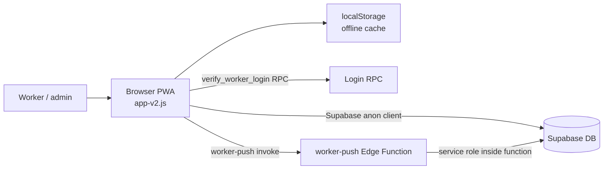
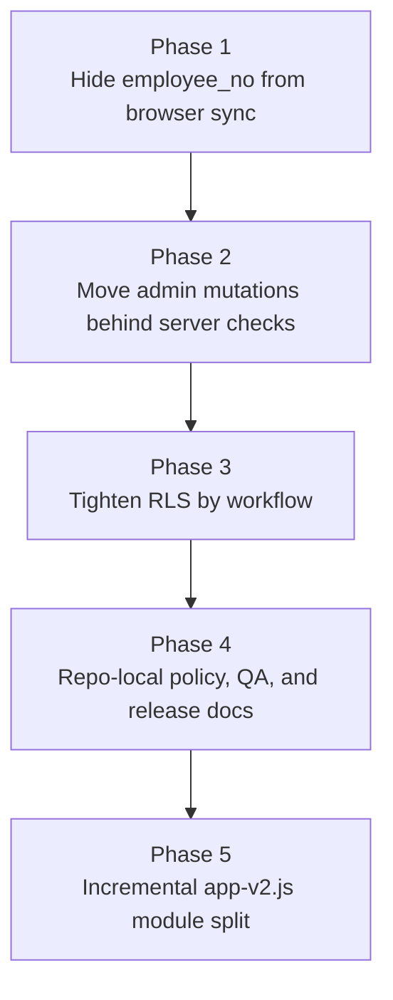

# GS Safety Checklist Security and Maintainability Baseline Design

## Purpose

This design defines the next maintenance direction for the GS Safety Checklist project after the v0.7 release. The priority is to make security boundaries explicit before splitting the large frontend runtime or adding more operational automation.

The user approved the following order on 2026-05-27:

1. Security/RLS/DB change safety
2. Repo-local policy and QA reproducibility
3. Release verification automation
4. Incremental `app-v2.js` decomposition

This document is a design baseline only. It does not approve immediate production schema changes or application rewrites.

## Current Model

The application is a static PWA deployed on Vercel. The browser downloads `index.html`, `assets/js/app-v2.js`, `assets/css/styles-v2.css`, and the service worker. The frontend uses Supabase directly for data sync and uses an Edge Function for push notifications.

The main security weakness is that the browser currently carries too much trust. The frontend bundle contains client-side admin/reset gates, the Supabase public client, and direct table sync logic. The `workers.employee_no` value is also mapped into the browser data model, which weakens any flow that treats employee number as a worker secret.

Supabase anon keys are public by design. The project must rely on RLS, RPCs, Edge Functions, and server-side checks for security.

## Goals

- Keep worker login secrets out of the browser data sync model.
- Make admin-level mutations server-validated instead of relying on JavaScript-only password checks.
- Reduce anon table permissions to the minimum needed for public field reads and field submissions.
- Keep the static PWA architecture intact during the first security pass.
- Preserve offline-friendly read flows where possible.
- Move project policies, QA expectations, and fresh-desktop setup into tracked repository files.
- Keep implementation incremental enough that each phase can be verified and rolled back.

## Non-Goals

- No framework migration.
- No large `app-v2.js` rewrite in the first phase.
- No immediate UI redesign.
- No APP_VERSION bump unless the implementation phase explicitly includes deployment.
- No Supabase secret, anon key, password, token, or service-role value should be copied into docs, prompts, or logs.

## Selected Approach

Use a staged hardening path.

This approach is recommended because the largest current risk is not file size. It is unclear trust boundaries. Once the trust boundaries are explicit, later refactoring can follow the real security model instead of preserving accidental client-side authority.

## Security Baseline Design

### Worker Public Data

The browser should not receive `workers.employee_no` through broad table sync.

The target shape is:

- Public worker list contains display and workflow fields only.
- Employee number comparison happens inside `verify_worker_login` or a replacement server-side function.
- Client state may keep a temporary typed employee number only for the active login attempt.
- Synced worker data should not include employee number after reload, Realtime updates, or polling fallback.

Recommended implementation unit:

1. Add a tracked Supabase migration that defines the public worker read path.
2. Use either a `workers_public` view or a `get_workers_public()` RPC.
3. Update `REMOTE_TABLES` mapping so browser sync reads from the public worker source.
4. Keep admin worker editing unchanged only until the admin mutation phase, but do not expose employee numbers in ordinary read paths.

### Worker Login

`verify_worker_login` should be treated as the only place that compares worker ID and employee number.

The project currently lacks a tracked source definition for this RPC. The next implementation should add it as a migration or documented SQL source so future desktops can reproduce it.

Default behavior:

- On success, return only the fields the app needs for the logged-in worker session.
- On failure, return a generic Korean error message.
- On offline failure, keep the existing Korean toast guidance.
- Do not leak whether a worker ID exists separately from whether the employee number matched.

### Push Notifications

`worker-push` should remain an Edge Function because it uses service-role privileges internally. Its trust input should not depend on a value that is public to the browser.

First pass:

- Ensure employee number is no longer public through frontend sync.
- Keep the current function behavior compatible.
- Document the later target of a short-lived server-validated worker session or token.

Later pass:

- Replace raw employee-number-based push authorization with a server-issued worker session/token.
- Add rate limiting and audit logs for push registration, device management, and unsafe issue broadcast.
- Restrict broad CORS only when the deployment origin list is stable enough to avoid field breakage.

### Admin and Reset Actions

Client-side admin/reset passwords are UI gates, not server authorization.

The first implementation should inventory direct admin mutation paths before changing them. The target model is:

- Admin actions call RPCs or Edge Functions.
- Server-side logic checks admin authority.
- RLS blocks anon direct update/delete for admin-managed tables.
- The frontend receives success/failure results, not database authority.

The first hardening phase should not remove current admin UI until replacement mutations are available.

### RLS

RLS should be tightened by workflow, not by one broad lock-down.

Workflow groups:

| Workflow | Target anon access |
| --- | --- |
| Public app boot/read | Read only approved public fields |
| Worker login | Execute login RPC only |
| Inspection submission | Insert allowed submission rows through constrained path |
| Unsafe issue/material submission | Insert allowed field reports; avoid public update/delete |
| Admin data management | No direct anon write; server-validated RPC/Function only |
| Push notification | Edge Function only for privileged data access |

Each RLS phase must include a rollback note and a live verification query/check.

## Repo-Local Policy and QA Design

The project currently depends on policy files outside the git root. A clean clone should not need the parent `.claude` directory to understand how to work on the app.

Target tracked layout:

- `AGENTS.md`: coding-agent rules, UI approval contract, deployment safety, Supabase secrecy.
- `README.md`: project overview, clone/setup, local serve, verify commands, production URL.
- `CONTRIBUTING.md`: change workflow, versioning, deployment, rollback expectations.
- `docs/ops/current-baseline.md`: current version, asset token, SW cache, production deployment facts.
- `docs/ops/fresh-desktop.md`: new desktop setup checklist.
- `docs/ops/qa.md`: verify, harness, live harness, visual QA.
- `docs/ops/supabase.md`: Supabase project boundaries, RLS/RPC migration rules, secret-handling policy.
- `docs/ops/deploy.md`: Vercel deployment and alias workflow.
- `docs/ops/versioning-cache.md`: APP_VERSION, asset token, SW cache rules.
- `tools/qa/` or `tests/visual/`: tracked QA scripts.
- `artifacts/visual-verification/`: ignored screenshots, profiles, and run artifacts.

The existing untracked handoff file should not be the long-term source of truth. It can be updated or replaced by tracked baseline docs during the policy phase.

## Release Documentation Design

The v0.7 release facts should be tracked in repo docs so future agents do not rely on chat history.

Required updates in the documentation phase:

- Add a 2026-05-27 v0.7 deployment record under `docs/deployments/`.
- Update or replace the stale `docs/handoff/codex-handoff-2026-05-27.md`.
- Clarify `VERSION.md` commit metadata so it distinguishes release HEAD/tag from any earlier baseline commit.
- Add a harness or release checklist item that surfaces untracked files before deployment.

## Incremental `app-v2.js` Split Design

Do not split `app-v2.js` before the security boundary work. Once the boundary is clear, split only low-risk units first.

Recommended order:

1. Pure validation and normalization helpers.
2. Supabase sync/read/write adapters.
3. Login/session helpers.
4. Push notification helpers.
5. Admin mutation helpers.
6. Renderers and route-specific UI only after the data and authority boundaries are stable.

Each extracted module should have one owner, a small public API, and at least one focused test or harness check.

## Verification Strategy

Security verification:

- Confirm browser worker sync no longer includes `employee_no`.
- Confirm `verify_worker_login` still succeeds for valid credentials and fails with a generic message for invalid credentials.
- Confirm anonymous direct reads cannot fetch employee numbers.
- Confirm anonymous direct updates/deletes are blocked where the phase intends to block them.
- Confirm `worker-push` remains functional for intended users after employee number exposure is removed.

Project reproducibility verification:

- Fresh clone can find instructions in tracked docs.
- `npm.cmd run verify` passes.
- `npm.cmd run harness` passes.
- `npm.cmd run harness:live` passes after production deployment.
- Visual QA scripts required by policy are tracked or have tracked replacements.
- `git status --short --ignored` is reviewed before release.

Browser/UI verification:

- No UI layout changes should be deployed without rendered browser verification.
- If a visual mockup or screenshot is approved, the implementation must match the approved visual before deployment.
- New edit flows should use inline, drawer-like, page-section, or existing screen patterns unless the user explicitly asks for a popup/modal.

## Rollout and Rollback

Each implementation phase should be separately reviewable and deployable.

Phase 1 rollback:

- Restore previous worker sync source.
- Revert the public worker source migration only if no dependent production code remains.
- Keep RPC definitions tracked even if app changes are rolled back.

Phase 2 rollback:

- Keep old admin UI available until server mutation parity is verified.
- Roll back Edge Function/RPC deployment before removing frontend fallback paths.

Phase 3 rollback:

- RLS migrations must include the previous policy names and enough SQL notes to restore the prior behavior.
- Production rollout should include live checks before and after policy changes.

## Risks

- Tightening RLS can break production flows that currently depend on broad anon access.
- Removing `employee_no` from sync can break admin worker editing if the UI still expects that field.
- Push flows currently depend on worker identity checks that may need a stronger session model later.
- The repo has local-only policy and visual QA assets; missing them can make future verification inconsistent.
- Some tooling uses machine-specific paths and should be made portable during the policy phase.

## Implementation Gate

Before implementation starts, the user should review this spec and approve the first implementation plan.

The recommended first plan is:

1. Document current Supabase worker/RLS state without printing secrets.
2. Add tracked SQL for public worker read path and login RPC source.
3. Update frontend worker sync to avoid `employee_no`.
4. Verify login, worker list rendering, Realtime/polling sync, and push compatibility.
5. Only then continue to repo policy/QA documentation.
